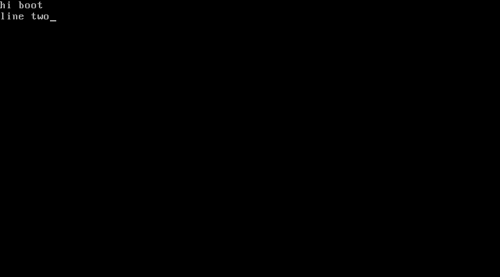
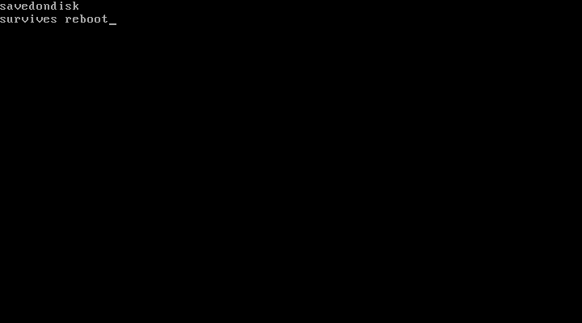

# bootpad — a text editor in a boot sector

**512 bytes. 166 of them are code.** No operating system, no filesystem, no
runtime, no libc — bootpad *is* the first sector of the disk. The BIOS loads it
and jumps to it, and it runs on the bare metal.

This is about as small as a genuinely standalone, functional editor gets.

```
you type       → printable characters appear
Enter          → newline
Backspace      → delete
Ctrl-S         → save to disk (survives a reboot)
```

Text is stored in sectors 2+ of the boot medium and **reloaded on boot**, so
what you saved is still there after you power-cycle the machine.

## It really works

Typing, with correct newline handling:



Persistence — this is a *fresh boot* after `Ctrl-S` and a full machine reset;
the text was reloaded from disk and the cursor parked at the end:



## How it works

- **BIOS is the whole runtime.** Keyboard via `int 0x16`, screen via the
  teletype call `int 0x10/AH=0Eh`, disk via `int 0x13` (read on boot, write on
  `Ctrl-S`). No OS underneath.
- **The buffer lives at `0x7E00`**, right after the sector in RAM. On boot we
  read the saved sectors into it and print until the first `NUL`, which also
  leaves the cursor at the end of the text so you can keep editing.
- **Newlines** are stored as a single `CR`; the teletype routine expands any
  `CR` to `CR`+`LF` on both echo and reload, so lines return to column 0.
- **512-byte constraint:** the last two bytes must be the boot signature
  `0x55AA`, so the code has 510 bytes to live in. It uses 166.

## Build & run

```
make            # assemble -> bootpad.bin, print code size + signature
make run        # boot it in QEMU (needs nasm + qemu-system-i386)
```

`make run` builds a 1.44 MB floppy image and boots it. Type something, hit
`Ctrl-S`, then reset the VM — your text comes back.

## Where this sits

The often-cited "World's Smallest Text Editor" (wste, 1148 bytes) is *Python
source* — it needs a ~30 MB interpreter to run. `tn` (in the parent directory)
is a 1220-byte self-contained Linux binary. **bootpad** goes to the floor:
a 512-byte sector that boots and edits with nothing under it at all.

| editor  | size            | needs to run          | standalone? |
|---------|-----------------|-----------------------|-------------|
| wste    | 1148 B (source) | ~30 MB Python runtime | no          |
| tn      | 1220 B (binary) | a Linux kernel        | yes         |
| bootpad | 512 B (sector)  | just a CPU + BIOS     | yes, fully  |
